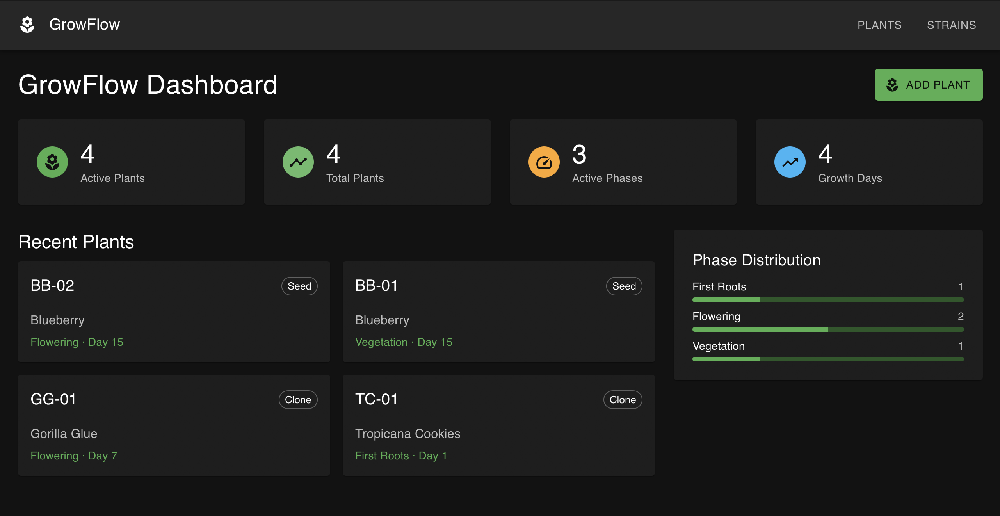
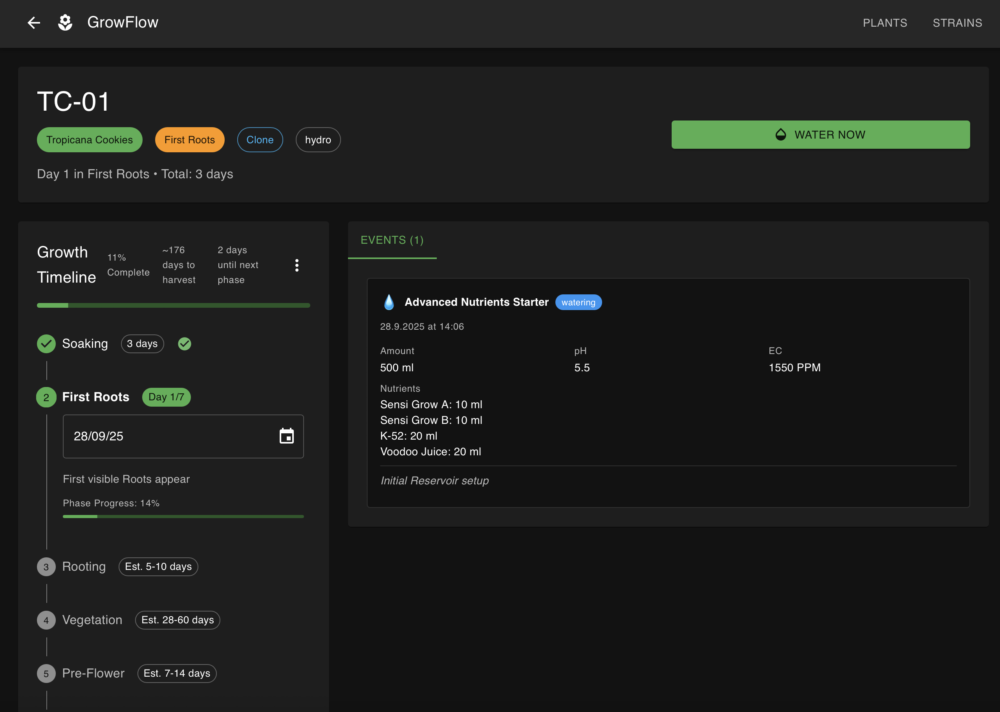

# GrowFlow - Plant Tracking System

_Comprehensive plant tracking system with complete lifecycle management and timeline documentation._

## About

GrowFlow is a standalone plant tracking application designed for documenting the complete grow process from germination to harvest. Built with modern web technologies, it provides detailed lifecycle tracking, care event logging, and comprehensive analytics for plant cultivation management.


_Dashboard with plant overview and status monitoring_


_Detailed plant timeline with phase tracking and care events_

## Features

- 🌱 **Complete Plant Lifecycle**: Track plants through 9 growth phases (germination → seedling → vegetation → pre_flower → flowering → flushing → harvest → drying → curing)
- 💧 **Care Event Logging**: Record watering, feeding, training, observations, and harvests with detailed data
- 🧬 **Strain Management**: Track genetics, breeding information, and custom phase templates
- 📈 **Timeline Analytics**: Complete plant timeline visualization and progress tracking
- 📊 **Dashboard Overview**: Monitor all active plants and their current status
- 🌐 **Modern Web UI**: Responsive Material-UI interface optimized for desktop and mobile

> ⚠️ This project is under active development. Features and interfaces may change.

## Tech Stack

- **Backend**: Express.js + TypeScript + SQLite + TypeORM
- **Frontend**: React + TypeScript + Material-UI + React Query
- **Database**: SQLite with TypeORM for reliable data persistence
- **Deployment**: Docker with multi-stage builds for production optimization

## Installation

### Docker Compose (Recommended)

1. Clone the repository:

```bash
git clone https://github.com/grow-flow/growflow.git
cd growflow
```

2. Start with Docker Compose:

```bash
docker-compose up -d
```

3. Access the application at `http://localhost:8080`

### Docker

```bash
# Build and run manually
docker build -t growflow:latest .
docker run -d -p 8080:8080 -v ./data:/app/data growflow:latest
```

### Development Setup

```bash
# Install dependencies
npm install
cd backend && npm install
cd ../frontend && npm install

# Start development servers
npm run dev                    # Start both backend and frontend
cd backend && npm run dev      # Backend only (port 8080)
cd frontend && npm start       # Frontend only (port 3000)
```

## Configuration

### Environment Variables

```bash
NODE_ENV=production           # Set to production for optimized performance
DB_PATH=/app/data/growflow.db # Database file location
LOG_LEVEL=info               # Logging verbosity (trace, debug, info, warn, error)
ALLOWED_FRAME_ANCESTORS="'self',*"  # CSP frame ancestors for iframe embedding
```

## Usage

1. **Add Strains**: Define genetics with custom phase templates and growing characteristics
2. **Plant Management**: Create plants, assign strains, and track through lifecycle phases
3. **Care Logging**: Record detailed watering, feeding, training, and observation events
4. **Timeline Tracking**: Monitor plant progress and view complete grow timelines
5. **Analytics**: Review historical data and optimize growing processes

## API Documentation

The application provides a RESTful API for all plant management operations:

- **Plants**: CRUD operations with phase management and event logging
- **Strains**: Genetic information and phase template management
- **Events**: Comprehensive care activity tracking with rich data structures

Health check endpoint available at `/api/health` for monitoring.

## Development

### Project Structure

```
growflow/
├── backend/           # Express.js API server
│   ├── src/models/   # TypeORM database models
│   ├── src/controllers/ # API route handlers
│   └── src/config/   # Application configuration
├── frontend/         # React web interface
│   ├── src/pages/   # Main application pages
│   ├── src/components/ # Reusable UI components
│   └── src/services/ # API client and utilities
└── data/            # SQLite database storage
```

### Development Commands

```bash
# Linting and type checking
npm run lint                  # Lint both backend and frontend
cd backend && npm run lint:fix # Auto-fix backend linting issues
cd frontend && npm run lint:fix # Auto-fix frontend linting issues

# Building
npm run build                 # Build both backend and frontend
cd backend && npm run build   # TypeScript compilation (type check)
cd frontend && npm run build  # React production build

# Testing
npm run test                  # Run all tests
cd backend && npm test        # Backend Jest tests
cd frontend && npm test       # Frontend React tests
```

## Deployment

### Production Deployment

The application is optimized for production deployment using Docker:

- **Multi-stage builds** for minimal image size
- **Layer caching** for fast rebuilds
- **Health checks** for container orchestration
- **Data persistence** via volume mounts
- **Environment-based configuration**

## Contributing

This is an active open-source project. Contributions are welcome through:

- Bug reports and feature requests via GitHub issues
- Code contributions via pull requests
- Documentation improvements
- Testing and feedback

Please ensure all code follows the established TypeScript and ESLint standards.

## License

MIT License

Copyright (c) 2025 GrowFlow
